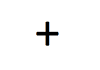
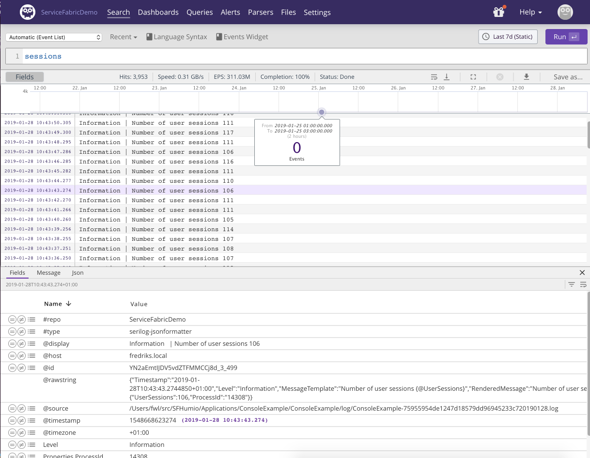
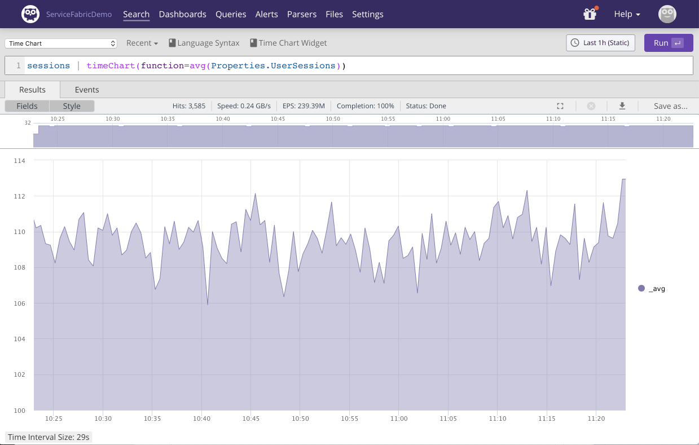
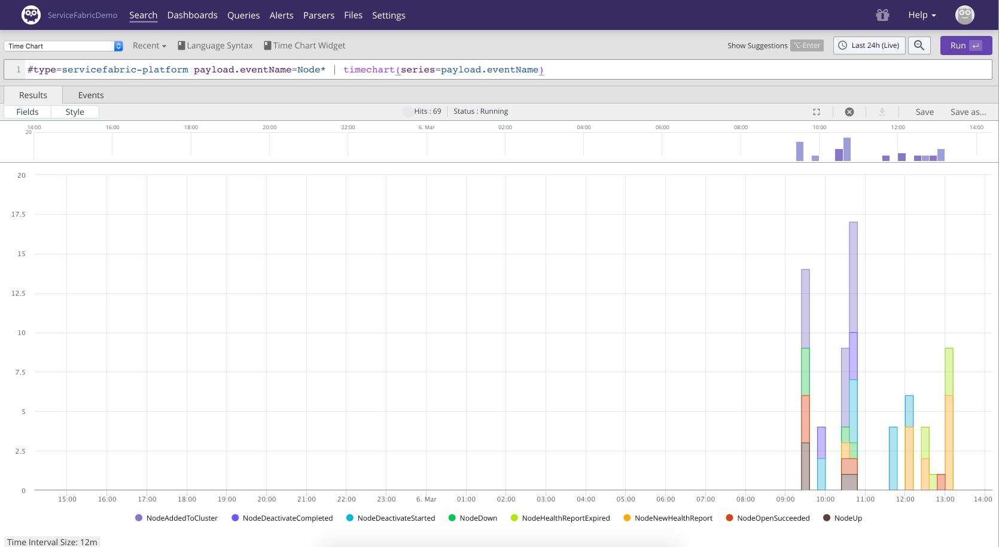
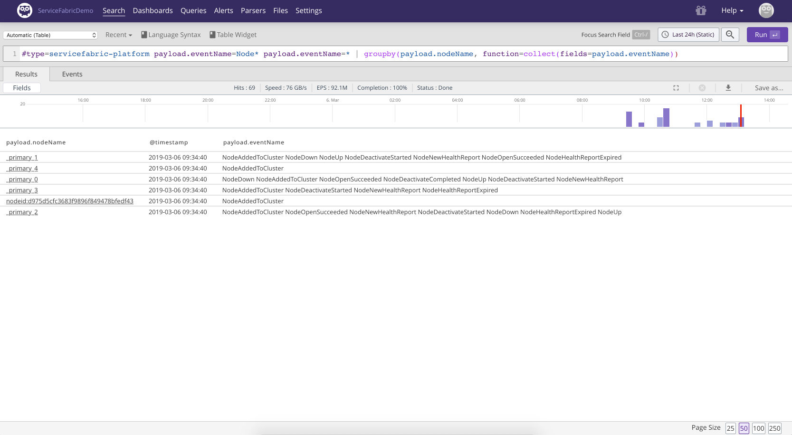
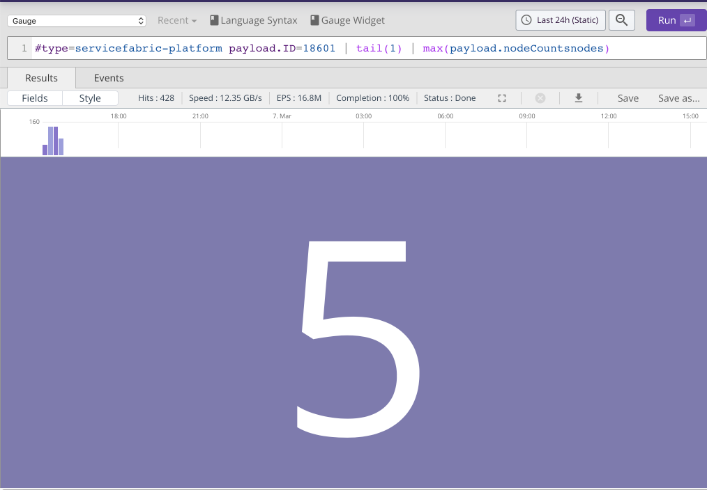
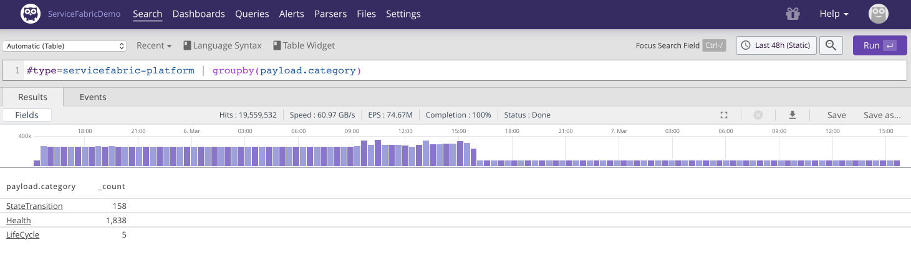
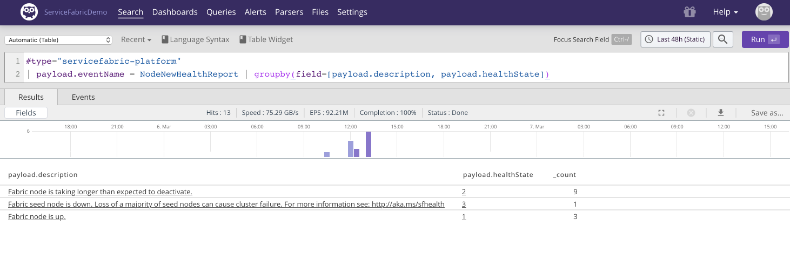
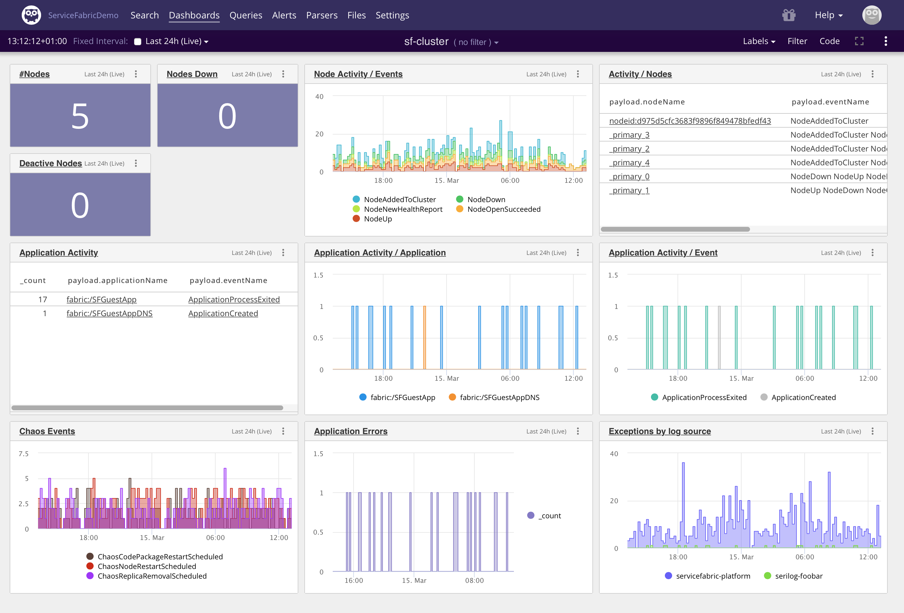

# Service Fabric and Humio





Azure Service Fabric is a distributed systems platform that makes it easy to package, deploy, and manage scalable and reliable microservices and containers. Developers and administrators can avoid complex infrastructure problems and focus on implementing mission-critical, demanding workloads that are scalable, reliable, and manageable.

Humio is a log management system, which enables you to log everything and answer anything in real-time. You can send, search, and visualize all logs instantly, easily, and affordably, On-Premises or in the Cloud.

This repo contains source and guides on how to use Humio together with Service Fabric clusters and applications.

**_Disclaimer_**
The content in this repo is to be considered as examples of how you can build out the setup described. It is by no means intended for production usage, without thorough testing. Please refer to documentation of the individual technologies used as part of this repository.

## Repo overview

The README.md file in the root (the one you are reading now), contains an overview of the solution. Guides for setting up specific pieces of the solution are contained in the README.md of subfolders. E.g. [Humio/README.md](Humio/README.md).

For the complete solution these steps are involved:

1. Setting up [Humio](Humio/README.md).
2. A running Service Fabric Cluster.
3. Installing the [Cluster Monitor Service](ClustermonitorService/README.md).
4. Creating a parser for the Service Fabric Events ingested by the Cluster Monitor Service. Make sure it's called 'servicefabric-platform'.
5. Installing [filebeat](FileBeatSFService/README.md)

For details, keep reading...

## Logging when running distributed applications in a Service Fabric cluster

In a Service Fabric setup, there are three layers of logging which needs to take place: infrastructure (servers etc.), platform (Service Fabric runtime) and applications (your distributed applications running in the cluster). For more information about these concepts, please refer to the [service fabric diagnostics overview](https://docs.microsoft.com/en-us/azure/service-fabric/service-fabric-diagnostics-overview).

As an example, there are various metrics and logs we want to collect on all three layers, and we can use different collection methods to accomplish this. Typically by installing an agent. In the case of using Humio as a logging and monitoring tool for a Service Fabric installation, we are using the following components:

| Layer | Instrument and Emit | Collect | Query and Analyze |
| --- | --- | --- | --- |
| Infrastructure | Hardware, Windows OS etc. using syslog, ETW, performance counters etc. | Not covered | Not covered |
| Platform | Service Fabric cluster and runtime using ETW  | ClusterMonitor service, using Microsoft.Diagnostics.EventFlow | Humio |
| Applications | Serilog for .net core outputting to log files | Filebeat | Humio |

For the infrastructure layer which we are not covering in this article, we suggest taking a look at [metricbeat](https://www.elastic.co/products/beats/metricbeat) and [winlogbeat](https://www.elastic.co/downloads/beats/winlogbeat) which also integrates with Humio. Humio offers excellent compression of ingested data (10x) and maintains no indices that take up your disk space and slows down your ingest. Supporting the philosophy of *logging everything*.

## The solution

In this section we will go over the different components and how we have used them in this setup.

### Platform

#### Service Fabric Platform Events

>The Service Fabric platform writes several structured events for key operational activities happening within your cluster. These range from cluster upgrades to replica placement decisions. Each event that Service Fabric exposes maps to one of the following entities in the cluster: Cluster, Application, Service, Partition, Replica and Container.

See [Service Fabric events](https://docs.microsoft.com/en-us/azure/service-fabric/service-fabric-diagnostics-events) for full details.

The platform events are collected by an, to the Service Fabric cluster itself, external service that runs on each machine participating in the cluster.
The service utilizes the [EventFlow diagnostics library](https://github.com/Azure/diagnostics-eventflow) which have support for several Inputs and Outputs of different formats. In our case the relevant Input is ETW (Event Tracing for Windows) since the Service Fabric Platform Events are available as an ETW provider. The Output is ´ElasticSearch´. Humio has support for the Elasticsearch bulk API for easy integration with existing log shippers and agents.

Details for installing the service can be found in [Cluster Monitor Service](ClustermonitorService/README.md).

**Note**
For the sake of this sample repo, we have increased the verbosity of the runtime to capture as much data as possible.

#### Parsing Service Fabric Platform Events with Humio

For the ETW log lines produced by Service Fabric and shipped by EventFlow we are going to write a [custom parser](https://docs.humio.com/parsers/#creating-a-custom-parser) in Humio. Parsers are written in Humios query language.

Creating a new parser in Humio means going to the repository used for ingesting data, selecting 'Parsers' in the menu and clicking 'New parser'. Make sure to call the parser `servicefabric-platform`.
Afterwards the parser should be assigned to the ingest token to be used, which is done under 'Settings' in the menu and then clicking 'Ingest API Tokens'. You can then change the 'Assigned Parser' through a dropdown box.

The ingest token configured here is used together with the [Cluster Monitor Service](ClustermonitorService/README.md) described above.

 The Service Fabric log lines contains both structured and unstructured data.
Here's an example:

`{"timestamp":"2019-02-26T10:40:51.0501913+00:00","providerName":"Microsoft-ServiceFabric","level":4,"keywords":1152921504606846977,"payload":{"ID":1284,"EventName":"PerfMonitor","Message":"Thread: 12, ActiveCallback: 1, Memory: 18,223,104, Memory Average: 18,223,104/18,051,085 ","threadCount":12,"activeCallback":1,"memory":18223104,"shortavg":18223104,"longavg":18051085}}`

As the log line stands right now it is ill-fit for a human operator. Reading the json data carefully we see that the `Message` fields is basically a summary of some of the other fields and represents a nice overview. Our parser will instead present this line in Humio:

`2019-02-26 11:40:51.050 | 4 | Microsoft-ServiceFabric | PerfMonitor | 1284 | Thread: 12, ActiveCallback: 1, Memory: 18,223,104, Memory Average: 18,223,104/18,051,085`

In other words, timestamp followed by level, providername, eventname, eventid and the message we identified before.
The parser code we end up with is:

 ```pascal
 parseJson()
 | @timestamp := parseTimestamp(field=timestamp)
 | @display := format(format="%s | %s | %s | %s ", field=[providerName, payload.ID, payload.EventName, payload.Message])
 | kvParse()
 ```

We start out by calling `parseJson()` which parses the log line as json and makes the json members available as fields on our [event](https://docs.humio.com/concepts/events/).
The result is then piped into parsing of the timestamp field which is assigned to a new `@timestamp` field. Humio interprets `@timestamp` as the event time, so it's essential to get right. If we do not want to display the raw log line in Humio, in this case json, the [@display](https://docs.humio.com/concepts/events/) field can be set to some formatted string. We finish the parsing by extracting any key value pairs, e.g. `foo=bar`, from the original log line.

**Errata**
In newer versions of Humio @display is no longer supported. We recommend using the column-based event list that allows for selection of specific fields. In the above parser simply leave the line containing @display out.

### Applications

For the [sample .net core application](Applications/ConsoleExample/README.md) in this repo, we are using Serilog and filebeat for shipping.

#### Serilog

[Serilog](https://serilog.net) is a popular logging framework for .NET. Serilog is focused on *structured* logging.
Doing structured logging means thinking about how the logs will be searched and analyzed afterwards. E.g. instrumenting a program with:

```csharp
Log.Information("Number of user sessions {@UserSessions}", userSessionCount);;
```

Should make it easy to aggregate `UserSessions`in your log management system afterwards.
With serilog you can configure where and how your log lines are outputted. The option we are going to choose is writing JSON formatted log lines to files. The above line would read as:

```json
{"Timestamp":"2019-01-28T09:38:08.3192070+01:00","Level":"Information","MessageTemplate":"Number of user sessions {@UserSessions}","RenderedMessage":"Number of user sessions 115","Properties":{"UserSessions":115}}
```

With the following configuration in code:

```csharp
var log = Path.Combine("log", $"ConsoleExample.log");
Log.Logger = new LoggerConfiguration()
                .Enrich.FromLogContext()
                .Enrich.With(new ServiceFabricEnricher())
                .WriteTo.File(
                    formatter: new JsonFormatter(renderMessage: true),
                    path: log,
                    retainedFileCountLimit: 5,
                    shared: true)
                .CreateLogger();
```

Note the `renderMessage: true` part of the configuration. This instructs Serilog to render the message as part of the formatted log output which ends up in our log files. As before we will use the @display feature in Humio which allows us to display the rendered message instead of the raw json data. This makes it easier for a human to process the log lines. All data is still available though, for searching and inspection etc. in Humio.

Our `ServiceFabricEnricher` class enriches our log lines with information from the node which the service instance is running on:

```csharp
 public class ServiceFabricEnricher : ILogEventEnricher
    {
        private static readonly string instanceId = Guid.NewGuid().ToString();
        private static readonly string processId = Process.GetCurrentProcess().Id.ToString();
        private static readonly string node = Environment.GetEnvironmentVariable("Fabric_NodeName");
        private static readonly string service = Environment.GetEnvironmentVariable("Fabric_ServiceName");
        private static readonly string application = Environment.GetEnvironmentVariable("Fabric_ApplicationName");

        public void Enrich(LogEvent logEvent, ILogEventPropertyFactory propertyFactory)
        {
            if (!string.IsNullOrWhiteSpace(instanceId))
            {
                logEvent.AddPropertyIfAbsent(new LogEventProperty("InstanceId", new ScalarValue(instanceId)));
            }

            if (!string.IsNullOrWhiteSpace(node))
            {
                logEvent.AddPropertyIfAbsent(new LogEventProperty("Fabric_NodeName", new ScalarValue(node)));
            }

            if (!string.IsNullOrWhiteSpace(service))
            {
                logEvent.AddPropertyIfAbsent(new LogEventProperty("Fabric_ServiceName", new ScalarValue(service)));
            }

            if (!string.IsNullOrWhiteSpace(application))
            {
                logEvent.AddPropertyIfAbsent(new LogEventProperty("Fabric_ApplicationName", new ScalarValue(application)));
            }

            if (!string.IsNullOrWhiteSpace(processId))
            {
                logEvent.AddPropertyIfAbsent(new LogEventProperty("ProcessId", new ScalarValue(processId)));
            }
        }
    }
```

Writing to a log file instead of shipping the logs in-process is a deliberate decision. The file acts as a persistent buffer between your program and your log management system which enables us to handle retransmissions and long lasting bursts of log lines.

#### Filebeat

We have our application logs formatted in JSON and written to files on disk, what's still missing is shipping the logs to Humio.
[Filebeat](https://docs.humio.com/integrations/data-shippers/beats/filebeat/) is a lightweight, cross platform shipper that is compatible with Humio.
Filebeat uses few resources, is easy to install and handles network problems gracefully.

The following filebeat configuration scrapes all logs from `D:\\SvcFab\_App` and subfolders named `log` with files ending in `.log`.
Humio is compatible with the elastic bulk API so we are using `output.elasticsearch`. The `hosts` parameter points to Humio cloud.
The `INGEST_TOKEN` needs to be replaced by a valid Ingest Token. Ingest Tokens are used in Humio to identify clients, selecting a repository for the incoming logs and selecting which parserr should be used.

```yaml
filebeat.inputs:
- type: log
  enabled: true
  paths:
    - "D:\\SvcFab\\_App\\**\\log\\*.log"
  encoding: utf-8

output.elasticsearch:
  hosts: ["https://cloud.humio.com:443/api/v1/ingest/elastic-bulk"]
  username: INGEST_TOKEN
  compression_level: 5
  bulk_max_size: 200
  worker: 1
```

We need to get the `INGEST_TOKEN` from Humio. A default ingest token is configured for your log repository in Humio. Log in to Humio, go to your log repository, click Settings and then Ingest API Tokens' and either retrieve the default or create a new one.
When you send logs and metrics to Humio for ingestion it needs to be parsed before it is stored in a repository. Humio has a built-in parser for Serilog that is configured as above. Make sure the Serilog parser is selected for the ingest token used. This is done by selecting the parser in the dropdown 'Assigned Parser' next to the Ingest Token.

If you are experimenting with filebeat from the command line start filebeat with `filebeat.exe -e -c filebeat.yml`. The `-e` flag instructs filebeat to log to the console which is useful when experimenting with the configuration.

### Query and analyze

This section contains some examples of using the humio query language to analyze and visualize the data.

#### Searching application logs

Let's take a look at a simple free text search in Humio:



We have searched for the word `sessions`, the result is displayed below and a specific log line has been selected with the details shown below the event list.

Let's say we want to plot the average number of user sessions the last hour:



The query pipes events containing `sessions` (via the ```|``` operator) into the `timechart` query function which uses the `avg` function. Consult the docs for more on [language syntax](https://docs.humio.com/language-syntax/) and [query functions](https://docs.humio.com/query-functions/).

Notice the `Properties.UserSessions`. This is a structured part of the Serilog log line that allows for easy analysis.
For any unstructured part of your log data that isn't turned into a property on your events by the parser, Humio allows for extracting the data using regular expressions which are then added as one or more fields to the events in question. See the query function [regex()](https://docs.humio.com/query-functions/#regex) for more information.

<!-- // TODO: or want the days where we at some point had less than.. -->

Often we want to get an overview of exceptions being thrown by our applications:

```pascal
Level=Error | groupby(field=[Properties.Fabric_ApplicationName, Exception])
```

The query groups exceptions by application name and exception message. Getting a total count of application exceptions can be achieved by:

```pascal
Level=Error | count()
```

Humio never rejects incoming logs, even logs it for some reason cannot parse. Doing the search `@error=* | groupBy(@error_msg)` will reveal any events that haven't been properly parsed and group them by reason.

#### Searching Service Fabric Platform Events

Service fabric node activity can be detected by looking at [Node lifecycle events](https://docs.microsoft.com/en-us/azure/service-fabric/service-fabric-diagnostics-event-generation-operational#node-events).

The following query visualizes the different node activities happening in the cluster the last 24 hours:

```pascal
#type=servicefabric-platform payload.eventName=Node* | timechart(series=payload.eventName)
```



With the following approach we group node activity by the name of the node and collect all activity events into a single field which gives us
a nice overview of the different activities related to a node.

```pascal
#type=servicefabric-platform payload.eventName=Node* payload.eventName=* | groupby(payload.nodeName, function=collect(fields=payload.eventName))
```



Digging around in the logs from Service Fabric reveals an interesting event type that we can use to build a few [gauges](https://docs.humio.com/widgets/gauge/) related to node state.

```pascal
#type=servicefabric-platform payload.ID=18601 | tail(1) | max(payload.nodeCountsdeactivatedNodes)
```

The same message also contains information about the number of nodes currently down:

```pascal
#type=servicefabric-platform payload.ID=18601 | tail(1) | max(payload.nodeCountsdownNodeCount)
```

In the dropdown above the search text field we can select the widget type 'Gauge'.
We can save to a new or existing [dashboard](https://docs.humio.com/concepts/dashboards/) by clicking 'Save as..'



<!--- talk about kv parser) --->

While we can try and infer node health given the node activity service fabric also provides [health reports](https://docs.microsoft.com/en-us/azure/service-fabric/service-fabric-health-introduction). Health reports are also communicated as [health report events](https://docs.microsoft.com/en-us/azure/service-fabric/service-fabric-diagnostics-event-generation-operational#health-reports).

For a cluster that is having issues health reports can be a significant fraction of the total number of events:

```pascal
#type=servicefabric-platform | groupby(payload.category)
````



Clicking on `Health` in the above search result reveals amongst others the `NodeNewHealthReport`. Let's try and get an overview of those:

```pascal
#type="servicefabric-platform"
| payload.eventName = NodeNewHealthReport | groupby(field=[payload.description, payload.healthState])
```



According to the [documentation](https://docs.microsoft.com/en-us/dotnet/api/system.fabric.health.healthstate?view=azure-dotnet) `payload.healthState=3` is an `Error` and needs investigation. So settings up [alerts](https://docs.humio.com/alerts/) for `#type="servicefabric-platform" payload.category=Health payload.healthState=3` is probably a good idea!

Combining the knowledge we have gained from digging into our logs, we can build a Service Fabric cluster dashboard:


